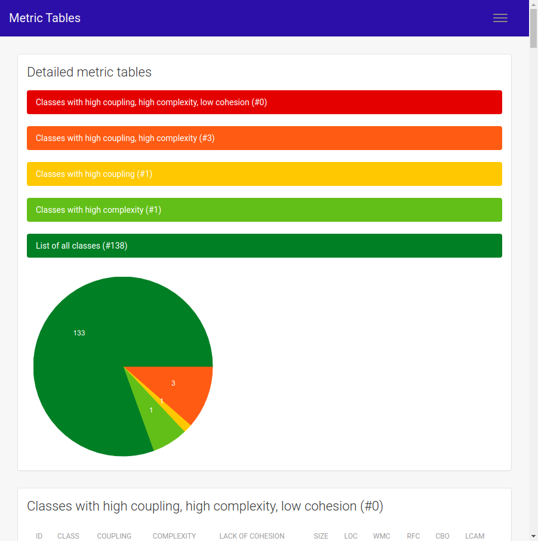
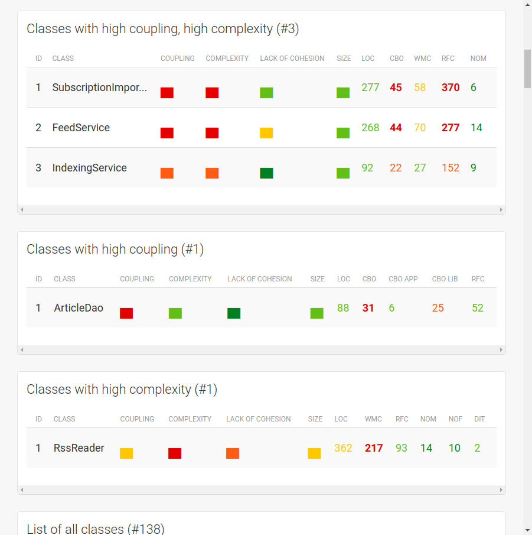
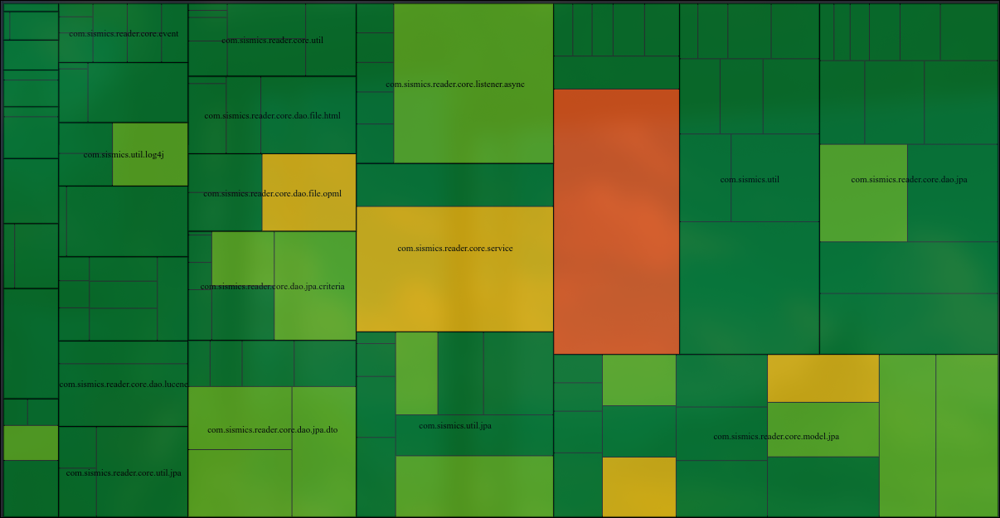
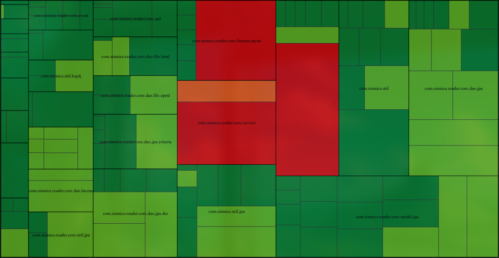
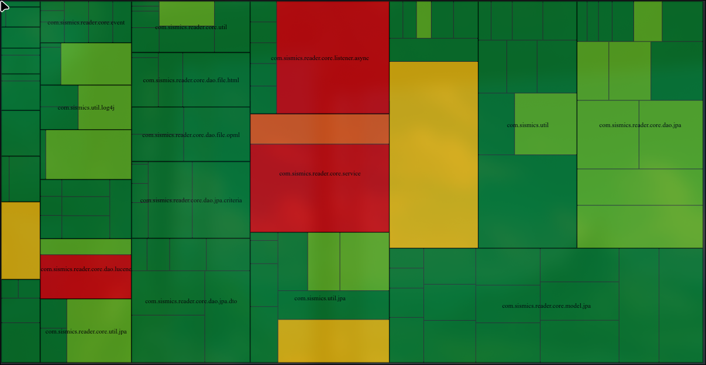
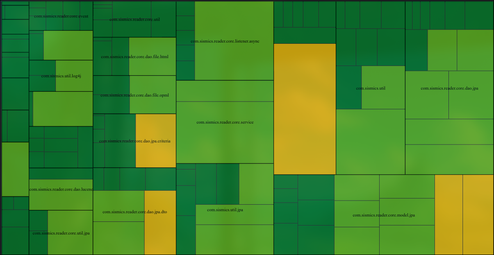

We used CodeMR and designite tools for the code metrics

---

# Information

This project contains

- 5537 lines of code
- 138 classes
- 28 packages

---

# Analysis

## Package-wise analysis

| Name                                             | Complexity | Coupling    | Size        | Lack of Cohesion |
| ------------------------------------------------ | ---------- | ----------- | ----------- | ---------------- |
| <Package> com.sismics.reader.core.dao.file.rss   | low-medium | low         | low-medium  | low              |
| <Package> com.sismics.reader.core.dao.jpa        | low        | medium-high | medium-high | low              |
| <Package> com.sismics.reader.core.dao.jpa.mapper | low        | low-medium  | low-medium  | low              |
| <Package> com.sismics.reader.core.event          | low        | low-medium  | low-medium  | low              |
| <Package> com.sismics.reader.core.listener.async | low        | low-medium  | low-medium  | low              |
| <Package> com.sismics.reader.core.model.jpa      | low-medium | medium-high | medium-high | low              |
| <Package> com.sismics.reader.core.service        | low        | low         | low-medium  | low              |
| <Package> com.sismics.reader.core.util           | low        | low-medium  | low-medium  | low              |
| <Package> com.sismics.util                       | low        | low-medium  | low-medium  | low              |
| <Package> com.sismics.util.jpa                   | low        | low-medium  | low-medium  | low              |

> Both the jpa packages have high coupling with the other packages

### Treemaps

#### Cohesion

#### Complexity

#### Coupling

#### Size

## Classes with high coupling, high complexity (#3)

com.sismics.reader.core.listener.async.SubscriptionImportAsyncListener \\
com.sismics.reader.core.service.FeedService \\
com.sismics.reader.core.service.IndexingService

## Classes with high coupling (#1)

com.sismics.reader.core.dao.lucene.ArticleDao

## Classes with high complexity (#1)

com.sismics.reader.core.dao.file.rss.RssReader

## CodeMR on these files

| ClassName                                                              | Name                            | CBO | DIT | NOC | WMC | LOC | NOM | LCOM  |
| ---------------------------------------------------------------------- | ------------------------------- | --- | --- | --- | --- | --- | --- | ----- |
| com.sismics.reader.core.dao.file.rss.RssReader                         | RssReader                       | 18  | 2   | 0   | 217 | 362 | 14  | 0.906 |
| com.sismics.reader.core.dao.lucene.ArticleDao                          | ArticleDao                      | 31  | 1   | 0   | 13  | 88  | 6   | 0.0   |
| com.sismics.reader.core.listener.async.SubscriptionImportAsyncListener | SubscriptionImportAsyncListener | 3   | 1   | 0   | 58  | 277 | 6   | 0.5   |
| com.sismics.reader.core.model.context.AppContext                       | AppContext                      | 15  | 1   | 0   | 17  | 66  | 10  | 0.9   |
| com.sismics.reader.core.service.FeedService                            | FeedService                     | 44  | 2   | 0   | 70  | 268 | 14  | 0.0   |

## Codalyze analysis on these files

### RssReader

| Function Name             | Start Line | End Line | Cyclomatic Complexity (Threshold: 10) | Lines of Code (Threshold: 50) | Parameter Count (Threshold : 4 ) |
| ------------------------- | ---------- | -------- | ------------------------------------- | ----------------------------- | -------------------------------- |
| RssReader::RssReader      | 197        | 199      | 1                                     | 3                             | 0                                |
| RssReader::readRssFeed    | 206        | 243      | 6                                     | 30                            | 1                                |
| RssReader::startElement   | 246        | 412      | **_133_**                             | **_160_**                     | 4                                |
| RssReader::endElement     | 415        | 485      | **_58_**                              | **_68_**                      | 3                                |
| RssReader::initFeed       | 490        | 494      | 1                                     | 5                             | 0                                |
| RssReader::pushElement    | 501        | 509      | 3                                     | 9                             | 1                                |
| RssReader::popElement     | 515        | 524      | 3                                     | 10                            | 0                                |
| RssReader::validateFeed   | 530        | 534      | 2                                     | 5                             | 0                                |
| RssReader::fixGuid        | 539        | 545      | 3                                     | 7                             | 0                                |
| RssReader::characters     | 548        | 555      | 2                                     | 8                             | 3                                |
| RssReader::fatalError     | 558        | 564      | 2                                     | 7                             | 1                                |
| RssReader::getContent     | 571        | 575      | 1                                     | 5                             | 0                                |
| RssReader::getFeed        | 582        | 584      | 1                                     | 3                             | 0                                |
| RssReader::getArticleList | 591        | 593      | 1                                     | 3                             | 0                                |

> startElement and endElement have a lot of lines of code and are also very complex.
> They have a lot of conditional statements.

### ArticleDao

| Function Name                      | Start Line | End Line | Cyclomatic Complexity (Threshold: 10) | Lines of Code (Threshold: 50) | Parameter Count (Threshold : 4 ) |
| ---------------------------------- | ---------- | -------- | ------------------------------------- | ----------------------------- | -------------------------------- |
| ArticleDao::rebuildIndex           | 44         | 55       | 2                                     | 9                             | 1                                |
| ArticleDao::create                 | 63         | 71       | 2                                     | 8                             | 1                                |
| ArticleDao::update                 | 78         | 86       | 2                                     | 8                             | 1                                |
| ArticleDao::delete                 | 93         | 100      | 2                                     | 7                             | 1                                |
| ArticleDao::search                 | 109        | 182      | 7                                     | **_60_**                      | 2                                |
| ArticleDao::getDocumentFromArticle | 190        | 204      | 1                                     | 11                            | 1                                |

> search is too long.

### IndexingService

| Function Name                       | Start Line | End Line | Cyclomatic Complexity (Threshold: 10) | Lines of Code (Threshold: 50) | Parameter Count (Threshold : 4 ) |
| ----------------------------------- | ---------- | -------- | ------------------------------------- | ----------------------------- | -------------------------------- |
| IndexingService::IndexingService    | 59         | 61       | 1                                     | 3                             | 1                                |
| IndexingService::startUp            | 64         | 78       | 5                                     | 14                            | 0                                |
| IndexingService::shutDown           | 81         | 96       | 5                                     | 16                            | 0                                |
| IndexingService::runOneIteration    | 99         | 103      | 1                                     | 4                             | 0                                |
| IndexingService::scheduler          | 106        | 108      | 1                                     | 3                             | 0                                |
| IndexingService::searchArticles     | 119        | 163      | 6                                     | 37                            | 4                                |
| IndexingService::rebuildIndex       | 169        | 172      | 1                                     | 4                             | 0                                |
| IndexingService::getDirectory       | 179        | 181      | 1                                     | 3                             | 0                                |
| IndexingService::getDirectoryReader | 190        | 213      | 6                                     | 24                            | 0                                |

> No major issue found

### FeedService

| Function Name                         | Start Line | End Line | Cyclomatic Complexity (Threshold: 10) | Lines of Code (Threshold: 50) | Parameter Count (Threshold : 4 ) |
| ------------------------------------- | ---------- | -------- | ------------------------------------- | ----------------------------- | -------------------------------- |
| FeedService::startUp                  | 62         | 63       | 1                                     | 2                             | 0                                |
| FeedService::shutDown                 | 66         | 67       | 1                                     | 2                             | 0                                |
| FeedService::runOneIteration          | 70         | 77       | 2                                     | 7                             | 0                                |
| FeedService::scheduler                | 80         | 83       | 1                                     | 3                             | 0                                |
| FeedService::synchronizeAllFeeds      | 88         | 131      | 7                                     | 38                            | 0                                |
| FeedService::synchronize              | 138        | 316      | **_23_**                              | **_137_**                     | 1                                |
| FeedService::completeArticleList      | 323        | 330      | 4                                     | 8                             | 1                                |
| FeedService::getArticleToRemove       | 337        | 372      | 7                                     | 27                            | 1                                |
| FeedService::getNewerArticleList      | 374        | 382      | 3                                     | 9                             | 2                                |
| FeedService::getOldestArticle         | 384        | 392      | 4                                     | 9                             | 1                                |
| FeedService::isFaviconUpdated         | 400        | 405      | 3                                     | 6                             | 1                                |
| FeedService::parseFeedOrPage          | 414        | 456      | 8                                     | 40                            | 2                                |
| FeedService::logParsingError          | 458        | 468      | 5                                     | 11                            | 2                                |
| FeedService::createInitialUserArticle | 477        | 500      | 4                                     | 22                            | 2                                |

> synchronize is very complex and is very lengthy.
> It has a lot of conditional statements and loops.

### SubscriptionImportAsyncListener

| Function Name                                          | Start Line | End Line | Cyclomatic Complexity (Threshold: 10) | Lines of Code (Threshold: 50) | Parameter Count (Threshold : 4 ) |
| ------------------------------------------------------ | ---------- | -------- | ------------------------------------- | ----------------------------- | -------------------------------- |
| SubscriptionImportAsyncListener::onSubscriptionImport  | 73         | 87       | 3                                     | 13                            | 1                                |
| SubscriptionImportAsyncListener::createJob             | 97         | 175      | 9                                     | **_62_**                      | 2                                |
| SubscriptionImportAsyncListener::getFeedCount          | 183        | 194      | 2                                     | 8                             | 1                                |
| SubscriptionImportAsyncListener::processImportFile     | 203        | 295      | **_16_**                              | **_79_**                      | 3                                |
| SubscriptionImportAsyncListener::importOutline         | 304        | 422      | **_15_**                              | **_95_**                      | 3                                |
| SubscriptionImportAsyncListener::importFeedFromStarred | 431        | 510      | **_13_**                              | **_67_**                      | 3                                |

> a lot of functions have lot of lines of code and are very complex

# What do these metrics mean?

**CBO (Coupling Between Object Classes):**  
CBO measures the number of classes a given class is coupled to by counting those it uses and those that use it (excluding inheritance). A high CBO indicates strong interdependencies, which can make maintenance more challenging and reduce reusability, as changes in one class may ripple through others. This increased coupling also requires more rigorous testing to ensure system stability.

---

**NOF (Number Of Fields):**  
NOF counts the total instance variables within a class, reflecting the amount of state it manages. A high NOF may suggest that the class is taking on too many responsibilities (potentially becoming a “God Class”), thereby increasing complexity and making the code harder to maintain. Conversely, an extremely low NOF in a data-centric class might indicate underutilization, though its direct impact on performance is minimal compared to its effect on clarity and design focus.

---

**NOPF (Number Of Public Fields):**  
NOPF quantifies the fields that are publicly accessible, serving as a direct measure of a class’s encapsulation. High NOPF often signals poor encapsulation and tight coupling, as external components can directly modify internal state, leading to fragile designs and increased maintenance risk. A low NOPF promotes better data protection and a more robust, modular design.

---

**NOM (Number Of Methods):**  
NOM is the total count of methods (both public and private) defined in a class, indicating the breadth of its functionality. A high NOM can either reflect a well-decomposed class that breaks complex tasks into manageable methods or a class with too many responsibilities, potentially increasing cognitive load and maintenance effort. The direct performance impact is minimal, but excessive methods can complicate understanding and reusability.

---

**NOPM (Number Of Public Methods):**  
NOPM measures the number of methods exposed in a class’s public interface. An excessive number of public methods can lead to a bloated interface that is harder to manage, prone to misuse, and challenging to evolve without breaking dependencies. Keeping NOPM low promotes a clear, focused interface that supports better encapsulation and maintainability.

---

**LOC (Lines Of Code):**  
LOC represents the total number of lines in a class or module, serving as a rough gauge of its size and complexity. High LOC often correlates with increased complexity and can indicate a class that is doing too much, making it harder to test and maintain. While LOC itself does not directly affect runtime performance, larger codebases may lead to longer compile times and an increased likelihood of bugs.

---

**WMC (Weighted Methods per Class):**  
WMC aggregates the complexity of all methods within a class—often using cyclomatic complexity as a basis. A high WMC suggests that the class contains many complex methods, which can lead to higher defect rates, increased testing efforts, and greater maintenance challenges. Conversely, a low WMC indicates simpler, more understandable methods that are easier to optimize and maintain.

---

**NC (Number of Constructors):**  
NC counts the number of constructors in a class, indicating the flexibility available for object instantiation. While multiple constructors can offer useful initialization options, an excessive number can complicate object creation and lead to inconsistent states, thereby increasing maintenance challenges. Typically, NC has minimal direct performance impact unless initialization logic is overly complex.

---

**DIT (Depth of Inheritance Tree):**  
DIT measures the length of the inheritance chain from a class to the root, showing how deeply embedded a class is in the hierarchy. A deep DIT can promote code reuse and polymorphism but also increases the complexity and cognitive load required to understand class behavior, as changes in superclasses can affect subclasses in unforeseen ways. The impact on runtime performance is generally minor, but maintainability may suffer.

---

**NOC (Number of Children):**  
NOC counts the direct subclasses of a class, reflecting how extensively a class is reused via inheritance. A high NOC implies that a class is central to the architecture, placing a greater burden on its maintainers to ensure stability, as modifications can have wide-reaching effects. This metric highlights potential maintenance challenges and the need for careful regression testing.

---

**LCOM (Lack of Cohesion of Methods):**  
LCOM quantifies how closely related the methods in a class are, with lower values indicating higher cohesion. High LCOM is a warning sign that a class may be handling multiple unrelated responsibilities, undermining its maintainability, testability, and clarity. Low LCOM suggests that methods are well-aligned with the class’s purpose, thereby supporting reliability and easier maintenance without a significant direct impact on performance.

---

**FANIN (Fan-in):**  
FANIN measures the number of external classes that depend on or call a given class, indicating its centrality and reusability. A high FANIN suggests that the class is widely used and critical to the system, meaning any changes can have widespread implications and require thorough testing. While a high FANIN is a sign of good reusability, it also increases the risk associated with modifying the class.

---

**FANOUT (Fan-out):**  
FANOUT counts the number of external classes that a class interacts with, reflecting its level of coupling. A high FANOUT indicates that the class depends on many external modules, potentially leading to a brittle design where changes in dependencies can cascade and complicate maintenance. Lower FANOUT is preferred for a modular, loosely coupled system that is easier to understand and modify.

---
