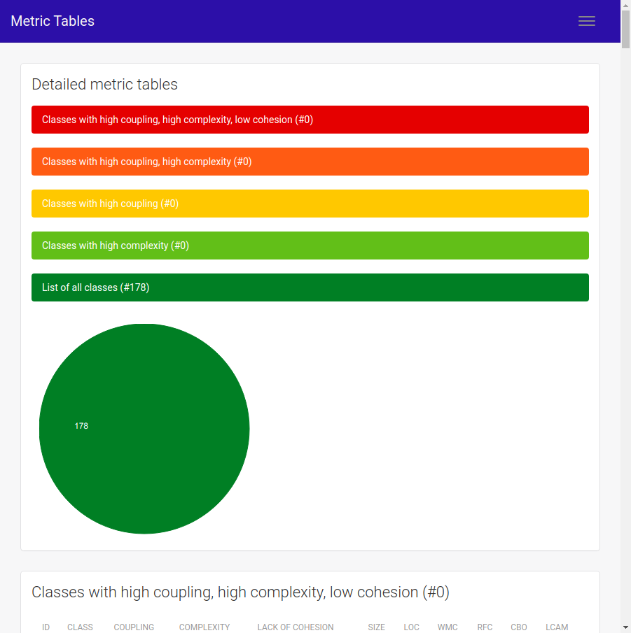
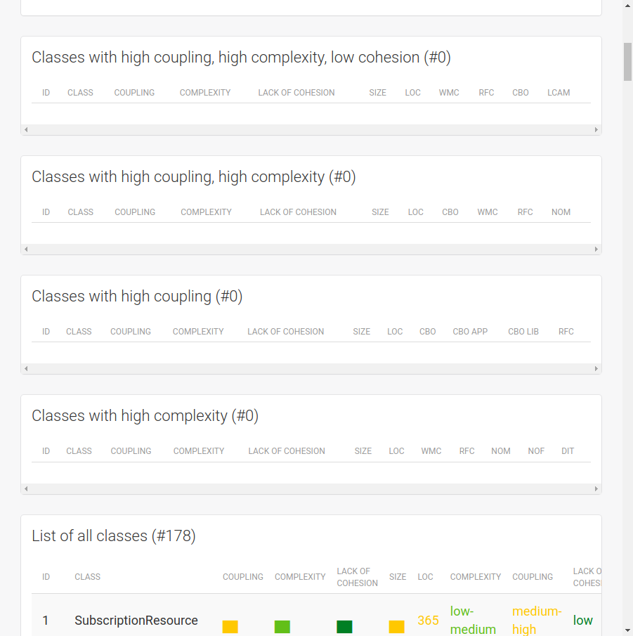
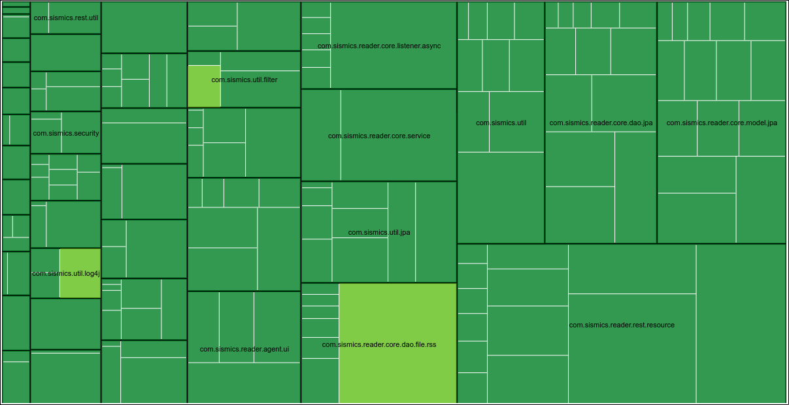
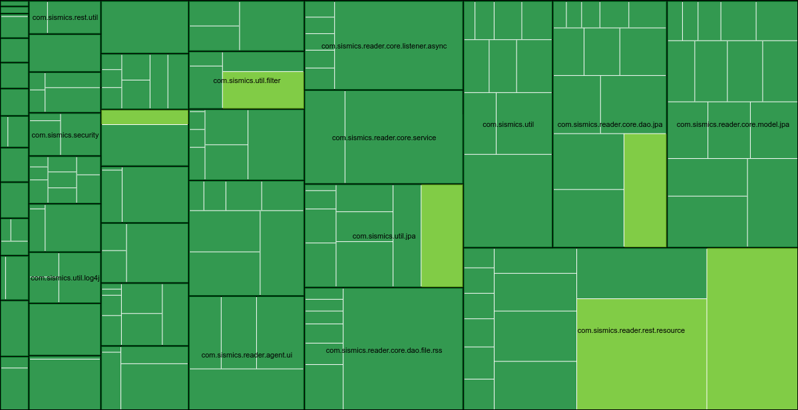
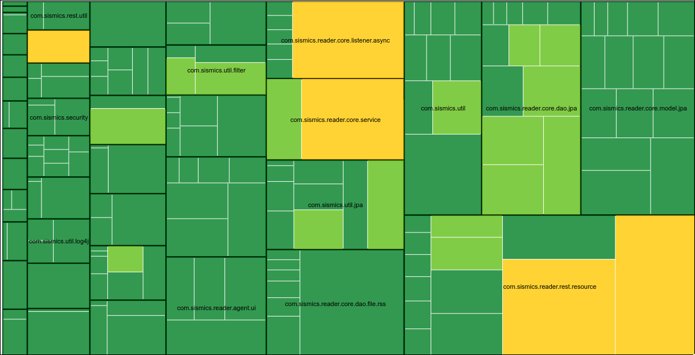
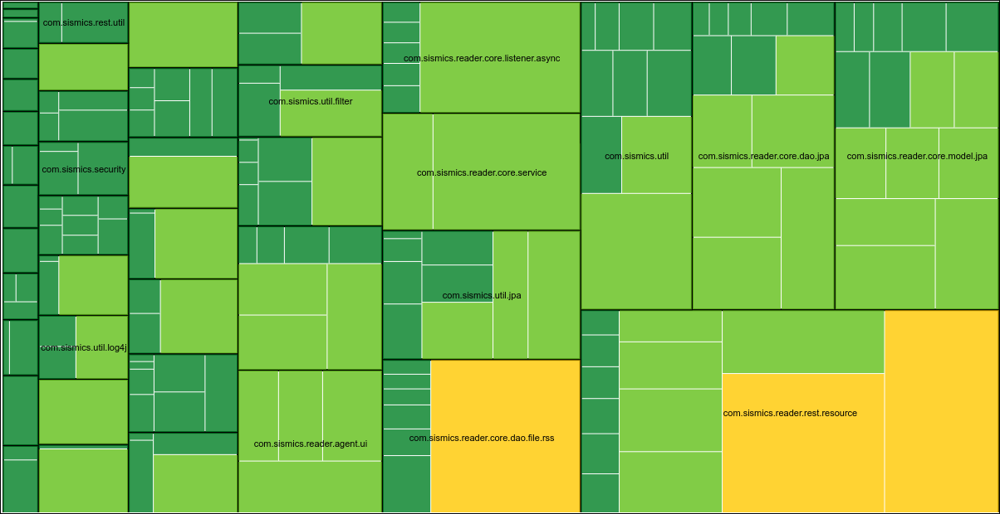

We used CodeMR and designite tools for the code metrics

---

# Information

This project contains

- 6247 lines of code
- 135 classes
- 28 packages

---

# Analysis

## Package-wise analysis

After refactoring, the coupling and complexity reduced.

| Name                                             | Complexity | Coupling   | Size        | Lack of Cohesion |
| ------------------------------------------------ | ---------- | ---------- | ----------- | ---------------- |
| <Package> com.sismics.reader.core.dao.file.rss   | low-medium | low        | low-medium  | low              |
| <Package> com.sismics.reader.core.dao.jpa        | low        | **medium** | medium-high | low              |
| <Package> com.sismics.reader.core.dao.jpa.mapper | low        | low-medium | low-medium  | low              |
| <Package> com.sismics.reader.core.event          | low        | low-medium | low-medium  | low              |
| <Package> com.sismics.reader.core.listener.async | low        | low-medium | low-medium  | low              |
| <Package> com.sismics.reader.core.model.jpa      | low-medium | **medium** | medium-high | low              |
| <Package> com.sismics.reader.core.service        | low        | low        | low-medium  | low              |
| <Package> com.sismics.reader.core.util           | low        | low-medium | low-medium  | low              |
| <Package> com.sismics.util                       | low        | low-medium | low-medium  | low              |
| <Package> com.sismics.util.jpa                   | low        | low-medium | low-medium  | low              |

### Treemaps

#### Cohesion

#### Complexity

#### Coupling

#### Size

## CodeMR on the files modified heavily

| Name                            | CBO | DIT | NOC | WMC | LOC | LCOM  | LTCC |
| ------------------------------- | --- | --- | --- | --- | --- | ----- | ---- |
| RssReader                       | 5   | 0   | 0   | 16  | 362 | 1.075 | 1.0  |
| ArticleDao                      | 7   | 0   | 0   | 1   | 88  | 0.0   | 0.0  |
| SubscriptionImportAsyncListener | 16  | 0   | 0   | 16  | 277 | 0.0   | 0.0  |
| AppContext                      | 13  | 0   | 0   | 17  | 66  | 0.893 | 1.0  |
| FeedService                     | 12  | 1   | 0   | 13  | 268 | 0.0   | 0.0  |

> - CBO has decreased in most classes. This indicates that the classes are now less dependent on other classes.
> - The lack of cohesion in RssReader has increased as indicated by both LCOM and LTCC.
> - WMCC has decreased significantly in all classes. This indicates that the classes are now more manageable and easier to maintain.
> - The DIT has also decreased in all classes.
> - LOC however has increased in all classes. This is due to the addition of new methods and refactoring of the existing code.

## Codalyze analysis on these files

### RssReader

| Function Name                           | Start Line | End Line | Cyclomatic Complexity (Threshold: 10) | Lines of Code (Threshold: 50) | Parameter Count (Threshold : 4 ) |
| --------------------------------------- | ---------- | -------- | ------------------------------------- | ----------------------------- | -------------------------------- |
| RssReader::RssReader                    | 198        | 202      | 1                                     | 5                             | 0                                |
| RssReader::readRssFeed                  | 209        | 246      | 6                                     | 30                            | 1                                |
| RssReader::initializeElementHandlers    | 249        | 284      | 1                                     | 27                            | 0                                |
| RssReader::startElement                 | 286        | 298      | 4                                     | 12                            | 4                                |
| RssReader::isRootElement                | 300        | 302      | 3                                     | 3                             | 1                                |
| RssReader::handleRss                    | 304        | 308      | 1                                     | 5                             | 1                                |
| RssReader::handleFeed                   | 310        | 316      | 1                                     | 7                             | 1                                |
| RssReader::handleRdf                    | 318        | 322      | 1                                     | 5                             | 1                                |
| RssReader::handleItem                   | 324        | 335      | 3                                     | 11                            | 1                                |
| RssReader::handleEntry                  | 337        | 348      | 2                                     | 11                            | 1                                |
| RssReader::handleLink                   | 350        | 359      | 2                                     | 9                             | 1                                |
| RssReader::handleComments               | 361        | 367      | 2                                     | 7                             | 1                                |
| RssReader::handleCreator                | 369        | 373      | 2                                     | 5                             | 1                                |
| RssReader::handleDate                   | 375        | 379      | 3                                     | 5                             | 1                                |
| RssReader::handleContentEncoded         | 381        | 385      | 2                                     | 5                             | 1                                |
| RssReader::handleContent                | 387        | 393      | 2                                     | 7                             | 1                                |
| RssReader::handleEnclosure              | 395        | 412      | 4                                     | 15                            | 1                                |
| RssReader::initializeEndElementHandlers | 416        | 435      | 1                                     | 17                            | 0                                |
| RssReader::endElement                   | 440        | 451      | 2                                     | 10                            | 3                                |
| RssReader::handleTitle                  | 452        | 459      | 3                                     | 8                             | 0                                |
| RssReader::handleLink                   | 461        | 468      | 3                                     | 8                             | 0                                |
| RssReader::handleDescription            | 470        | 475      | 2                                     | 6                             | 0                                |
| RssReader::handleLanguage               | 477        | 482      | 2                                     | 6                             | 0                                |
| RssReader::handleGuid                   | 484        | 489      | 2                                     | 6                             | 0                                |
| RssReader::handleComments               | 491        | 502      | 6                                     | 12                            | 0                                |
| RssReader::handleItemDescription        | 504        | 509      | 3                                     | 6                             | 0                                |
| RssReader::handleCreator                | 511        | 516      | 3                                     | 6                             | 0                                |
| RssReader::handleDate                   | 518        | 523      | 3                                     | 6                             | 0                                |
| RssReader::handlePubDate                | 525        | 530      | 2                                     | 6                             | 0                                |
| RssReader::handleContentEncoded         | 532        | 537      | 3                                     | 6                             | 0                                |
| RssReader::handleSummary                | 539        | 544      | 3                                     | 6                             | 0                                |
| RssReader::handleContent                | 546        | 551      | 2                                     | 6                             | 0                                |
| RssReader::handleAuthorName             | 553        | 558      | 2                                     | 6                             | 0                                |
| RssReader::initFeed                     | 563        | 567      | 1                                     | 5                             | 0                                |
| RssReader::pushElement                  | 574        | 582      | 3                                     | 9                             | 1                                |
| RssReader::popElement                   | 588        | 597      | 3                                     | 10                            | 0                                |
| RssReader::validateFeed                 | 603        | 607      | 2                                     | 5                             | 0                                |
| RssReader::fixGuid                      | 612        | 618      | 3                                     | 7                             | 0                                |
| RssReader::characters                   | 621        | 628      | 2                                     | 8                             | 3                                |
| RssReader::fatalError                   | 631        | 637      | 2                                     | 7                             | 1                                |
| RssReader::getContent                   | 644        | 648      | 1                                     | 5                             | 0                                |
| RssReader::getFeed                      | 655        | 657      | 1                                     | 3                             | 0                                |
| RssReader::getArticleList               | 664        | 666      | 1                                     | 3                             | 0                                |

### IndexingService

| Function Name                       | Start Line | End Line | Cyclomatic Complexity (Threshold: 10) | Lines of Code (Threshold: 50) | Parameter Count (Threshold : 4 ) |
| ----------------------------------- | ---------- | -------- | ------------------------------------- | ----------------------------- | -------------------------------- |
| IndexingService::IndexingService    | 59         | 61       | 1                                     | 3                             | 1                                |
| IndexingService::startUp            | 64         | 78       | 5                                     | 14                            | 0                                |
| IndexingService::shutDown           | 81         | 96       | 5                                     | 16                            | 0                                |
| IndexingService::runOneIteration    | 99         | 103      | 1                                     | 4                             | 0                                |
| IndexingService::scheduler          | 106        | 108      | 1                                     | 3                             | 0                                |
| IndexingService::searchArticles     | 119        | 163      | 6                                     | 37                            | 4                                |
| IndexingService::rebuildIndex       | 169        | 172      | 1                                     | 4                             | 0                                |
| IndexingService::getDirectory       | 179        | 181      | 1                                     | 3                             | 0                                |
| IndexingService::getDirectoryReader | 190        | 213      | 6                                     | 24                            | 0                                |

### FeedService

| Function Name                                    | Start Line | End Line | Cyclomatic Complexity (Threshold: 10) | Lines of Code (Threshold: 50) | Parameter Count (Threshold : 4 ) |
| ------------------------------------------------ | ---------- | -------- | ------------------------------------- | ----------------------------- | -------------------------------- |
| FeedService::startUp                             | 63         | 64       | 1                                     | 2                             | 0                                |
| FeedService::shutDown                            | 67         | 68       | 1                                     | 2                             | 0                                |
| FeedService::runOneIteration                     | 71         | 79       | 2                                     | 7                             | 0                                |
| FeedService::scheduler                           | 82         | 86       | 1                                     | 3                             | 0                                |
| FeedService::synchronizeAllFeeds                 | 91         | 134      | 7                                     | 38                            | 0                                |
| FeedService::synchronize                         | 141        | 165      | 2                                     | 18                            | 1                                |
| FeedService::parseFeedOrPage                     | 261        | 303      | 8                                     | 40                            | 2                                |
| FeedService::logParsingError                     | 305        | 315      | 5                                     | 11                            | 2                                |
| FeedService::createInitialUserArticle            | 325        | 349      | 4                                     | 22                            | 2                                |
| FeedService::ArticleService::ArticleService      | 361        | 364      | 1                                     | 3                             | 1                                |
| FeedService::ArticleService::getArticleToRemove  | 369        | 405      | 7                                     | 28                            | 0                                |
| FeedService::ArticleService::getNewerArticleList | 407        | 415      | 3                                     | 9                             | 2                                |
| FeedService::ArticleService::getOldestArticle    | 417        | 426      | 4                                     | 9                             | 1                                |
| FeedService::ArticleService::completeArticleList | 431        | 438      | 4                                     | 8                             | 0                                |
| FeedService::ArticleService::removeOldArticles   | 443        | 477      | 6                                     | 27                            | 0                                |
| FeedService::ArticleService::call                | 479        | 482      | 1                                     | 4                             | 0                                |
| FeedService::CreateFeed::createFeed              | 487        | 535      | 7                                     | 39                            | 1                                |
| FeedService::CreateFeed::isFaviconUpdated        | 543        | 549      | 3                                     | 7                             | 1                                |
| FeedService::ManageArticles::ManageArticles      | 560        | 574      | 3                                     | 13                            | 2                                |
| FeedService::ManageArticles::updateArticles      | 576        | 620      | 6                                     | 38                            | 0                                |
| FeedService::ManageArticles::createArticles      | 622        | 662      | 4                                     | 30                            | 0                                |
| FeedService::ManageArticles::call                | 664        | 667      | 1                                     | 4                             | 0                                |
| FeedService::ManageArticles::getArticleMap       | 669        | 671      | 1                                     | 3                             | 0                                |

### SubscriptionImportAsyncListener

| Function Name                                         | Start Line | End Line | Cyclomatic Complexity (Threshold: 10) | Lines of Code (Threshold: 50) | Parameter Count (Threshold : 4 ) |
| ----------------------------------------------------- | ---------- | -------- | ------------------------------------- | ----------------------------- | -------------------------------- |
| SubscriptionImportAsyncListener::onSubscriptionImport | 75         | 89       | 3                                     | 13                            | 1                                |
| SubscriptionImportAsyncListener::createJob            | 100        | 145      | 4                                     | 36                            | 2                                |
| SubscriptionImportAsyncListener::getOutlineCount      | 147        | 187      | 6                                     | 32                            | 3                                |
| SubscriptionImportAsyncListener::getFeedCount         | 195        | 206      | 2                                     | 8                             | 1                                |
| SubscriptionImportAsyncListener::processImportFile    | 215        | 253      | 8                                     | 34                            | 3                                |
| SubscriptionImportAsyncListener::getOutlineList       | 255        | 293      | 6                                     | 32                            | 3                                |
| SubscriptionImportAsyncListener::importOutline        | 302        | 425      | **_15_**                              | **_100_**                     | 3                                |

> We can observe that the methods are now well within the thresholds for cyclomatic complexity, lines of code and parameter count.

## Designite analysis

- **MainActivity:** Decreased LOC (321→0) and FANIN (1→0), with a slight decrease in FANOUT (13→12).  
  _Positive:_ Clears out extraneous code and reduces coupling.  
  _Tradeoff:_ Shifts responsibilities that must be managed elsewhere.

- **UserResource:** Increased FANOUT (18→24) while LOC remains unchanged (445).  
  _Positive:_ Likely adds functionality or delegates tasks.  
  _Tradeoff:_ Higher external calls may increase coupling and dependency complexity.

- **BaseResource (Variant 1):** All metrics unchanged (NOF: 3, NOM: 3, LOC: 53, FANOUT: 2).  
  _Positive:_ Stable, optimal design.  
  _Tradeoff:_ No further optimization opportunities applied.

- **BaseResource (Variant 2):** Increased NOM (3→4) and FANOUT (2→3) with decreased LOC (53→39).  
  _Positive:_ Successful decomposition into smaller, focused methods.  
  _Tradeoff:_ Slight increase in coupling (FANOUT) could pose minor dependency risks.

- **SecurityFilter:** Decreased FANIN (2→1) and FANOUT (7→6).  
  _Positive:_ Reduced coupling leads to a clearer separation of concerns.  
  _Tradeoff:_ Fewer incoming calls might limit its reusability by other components.

- **RequestContextFilter:** All metrics remain essentially unchanged.  
  _Positive:_ Indicates a well-designed, stable class.  
  _Tradeoff:_ No direct improvements, which is acceptable given its optimal state.

- **LocaleUtil:** All metrics remain unchanged.  
  _Positive:_ Demonstrates robust utility design.  
  _Tradeoff:_ No refactoring benefits applied, though functionality remains clear.

- **IndexingService:** All metrics remain unchanged.  
  _Positive:_ Stability confirms its design serves its purpose effectively.  
  _Tradeoff:_ No enhancements, but performance is maintained.

- **FeedService:** Increased NOM (16→32), LOC (350→371), WMC (56→69), and FANOUT (20→28); decreased LCOM (0.4375→0.21875).  
  _Positive:_ Method decomposition improves cohesion and maintainability.  
  _Tradeoff:_ More methods and external interactions may raise overall complexity and coupling.

- **SubscriptionImportAsyncListener:** Decreased LOC (391→370) and WMC (42→40) with increased FANOUT (18→32).  
  _Positive:_ A leaner design with lower overall code size.  
  _Tradeoff:_ Increased external dependencies might complicate future maintenance.

- **UserDao:** Increased FANIN (1→3) and FANOUT (5→6).  
  _Positive:_ Becoming a more central, reusable component.  
  _Tradeoff:_ Elevated coupling risks turning it into a “god class” without proper modularization.

- **RssReader:** Increased NOF (22→25), NOM (14→43), and FANOUT (7→8); decreased LOC (447→425) and WMC (97→86).  
  _Positive:_ Breaking down methods improves cohesion and maintainability.  
  _Tradeoff:_ A higher number of methods can make navigation more challenging despite reduced per-method complexity.

- **RssReader.FeedType & RssReader.Element:** New helper/inner classes introduced with minimal LOC and WMC.  
  _Positive:_ Clarifies design by isolating helper functionality.  
  _Tradeoff:_ Additional components may slightly complicate the overall project structure.

- **AtomUrlGuesser (Merged Class):** Increased NOM (merged to 4), LOC (increased to 84), and WMC (increased to 22).  
  _Positive:_ Merging similar strategies reduces redundancy and centralizes functionality.  
  _Tradeoff:_ Consolidation leads to higher complexity within a single class that requires careful management.

- **Constants:** Decreased NOF (14→1), LOC (62→12), and FANIN (7→6).  
  _Positive:_ Replacing a bloated class with an enum greatly simplifies design and improves encapsulation.  
  _Tradeoff:_ Changes may necessitate updates in areas that previously depended on the old structure.

- **StarredReader:** Increased NOF (2→3), NOM (2→6), NOPM (2→6), LOC (91→112), and WMC (13→16) with decreased FANOUT (5→3).  
  _Positive:_ Decomposing functionality into more methods enhances modularity and lowers coupling.  
  _Tradeoff:_ An increase in size and complexity could make the class bulkier if not carefully managed.

- **StarredArticleImportedListener:** Class completely removed.  
  _Positive:_ Simplifies overall architecture by eliminating redundancy.  
  _Tradeoff:_ Its functionality must be redistributed to avoid gaps.

---

# Conclusion

The refactoring has resulted in a more maintainable codebase. The classes are now less dependent on each other and the complexity has reduced. The cohesion has improved (as seen by increased NOM, reduced WMC per method).
The clarity of the code has improved with the removal of redundant code and the introduction of helper classes. (e.g., merging strategies and simplifying constants).

---
